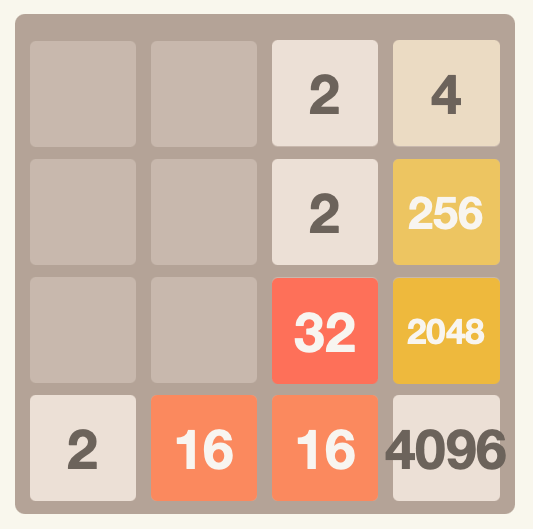

# 2048 AI

# Heuristic

| Metric       | Weight | Typical Range | Impact Range |
|--------------|--------|---------------|--------------|
| Free tiles   | 15.0   | 0-16 tiles    | 0 to 240     |
| Monotonicity | -5.0   | 0-80 penalty  | 0 to -400    |
| Smoothness   | -0.5   | 20-60         | -10 to -30   |
| Merge        | 20.0   | 1-4 pairs     | 20 to 80     |
| Border       | -4.0   | 10-50 penalty | -40 to -200  |
