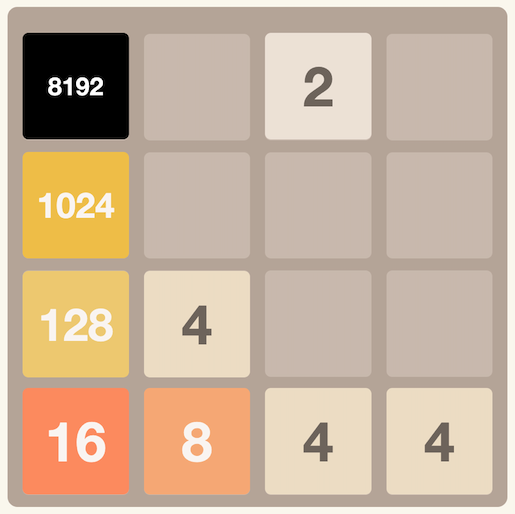

# 2048 AI

An AI player for the 2048 game, using the expectimax algorithm combined with heuristic evaluation to select best future moves. The algorithm explores possible moves, averages over random tile spawns, and scores each resulting board to pick the best action.



## Heuristic

The heuristic measures how good a board is:

| Metric          | Weight | Typical Range | Impact Range | Description                                         |
|-----------------|--------|---------------|--------------|-----------------------------------------------------|
| Free tiles      | +15.0  | 0–16 tiles    | 0 to +240    | Rewards having empty cells (more flexibility).      |
| Monotonicity    | −5.0   | 0–80 penalty  | 0 to −400    | Penalizes rows/columns that break decreasing order. |
| Smoothness      | −0.5   | 20–60         | −10 to −30   | Penalizes large differences between neighbors.      |
| Merge potential | +20.0  | 1–4 pairs     | +20 to +80   | Rewards tiles that can merge next move.             |
| Border penalty  | −4.0   | 10–50 penalty | −40 to −200  | Penalizes large tiles away from edges.              |

Using the weights above, it evaluates all possible player moves (with a few exceptions) and runs an expectimax search to predict how future random tile spawns (`2` or `4`) will affect the board.

Each board is scored using a weighted sum of heuristic factors such as free space, smoothness, monotonicity, merges, and border position (the higher the score, the better the board configuration).

Basically, at each node:

- **Max layer:** chooses the move with the best expected value.
- **Chance layer:** averages over all possible new tile spawns.

The recursion depth controls how far the search algorithm "look" ahead.

## Testing

The project includes a test utility class (`js/game-test.js`) that provides convenient functions for testing and debugging the game logic (e.g., set up specific board states to test the game over specific conditions). It can be used from the browser's developer console.

### Board Setup Functions

```javascript
// Set individual tiles (1-4 based row/col indexing)
setTile(1, 1, 4096);  // Set top-left to 4096

// Initialize custom board
initBoard([
    [2048, 1024, 512, 256],
    [128, 64, 32, 16], 
    [8, 4, 2, 0],
    [0, 0, 0, 0]
]);

// Preset test scenarios
testHighValues();  // Load board with high value tiles
testNearWin();     // Load near-win scenario
testGameOver();    // Load game over scenario
clearBoard();      // Empty board
```

### Move Functions

```javascript
// Make individual moves
moveUp();
moveDown(); 
moveLeft();
moveRight();

// Check current state
getCurrentBoard();  // Display board in console
```
